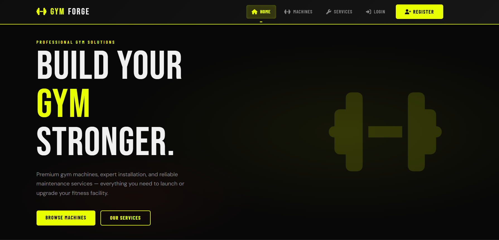
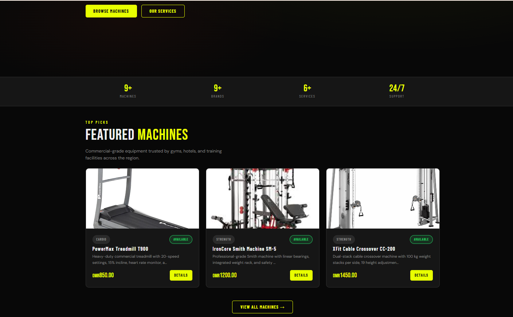
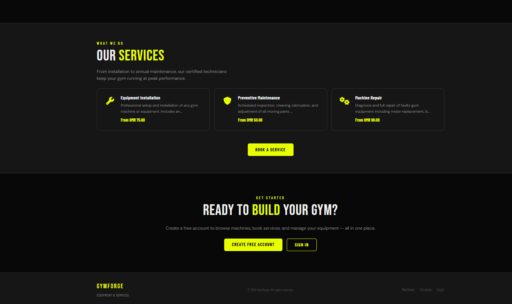
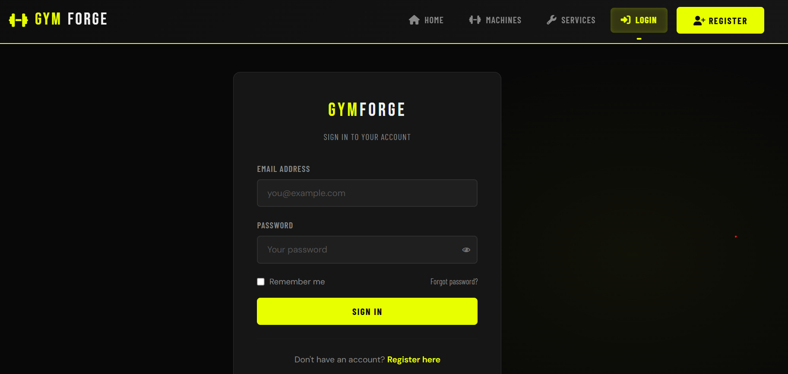
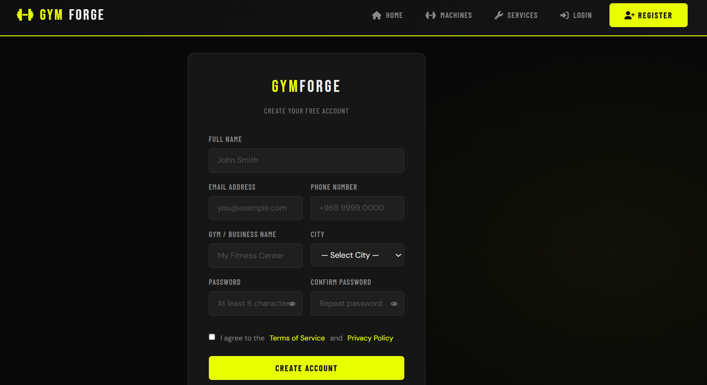
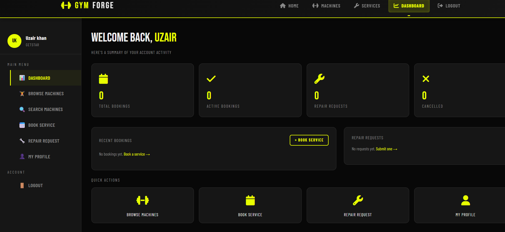
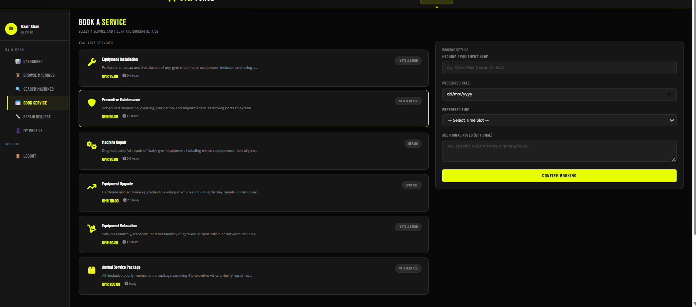

# GymForge 💪

**A comprehensive gym equipment and service management platform**


## 📸 Project Overview

GymForge is a full-featured gym equipment and service management system that enables users to browse gym machines, book services, track bookings, and manage repair requests. Built with a modern tech stack, it demonstrates practical full-stack development skills with real-world application.

**Use Case:** Gym owners can manage their equipment inventory, customers can book services, and both can track maintenance requests efficiently.

---

## ⭐ Key Features

### 🔐 **Authentication & Security**
- Secure user registration and login
- Session-based authentication
- Password-protected routes
- Logout functionality
- Protected dashboard access

### 🏋️ **Equipment Management**
- Browse commercial gym equipment catalog
- View detailed machine specifications
- Filter equipment by category
- Search machines by name
- Display pricing and availability status
- Equipment image gallery

### 🛠️ **Service Management**
- Equipment installation services
- Preventive maintenance packages
- Machine repair services
- Equipment upgrade services
- Annual maintenance contracts
- Service pricing and descriptions

### 📅 **Online Booking System**
- Book gym services with date/time selection
- Add custom booking notes
- Real-time booking confirmation
- Persistent storage in database
- Track all bookings from dashboard
- Booking status updates

### 🔧 **Repair Request System**
- Submit equipment repair requests
- Specify equipment details
- Set urgency levels (Low/Medium/High/Critical)
- Describe technical issues
- Track repair request status
- Store historical requests

### 📊 **User Dashboard**
- Booking summary and history
- Active bookings overview
- Repair request tracking
- Quick-access shortcuts
- User statistics

### 👤 **Profile Management**
- Update personal information
- Edit gym/business details
- Change account password
- Manage contact information
- Profile picture support

### 📱 **User Interface**
- Modern dark-themed design
- Responsive layout (desktop-optimized)
- Intuitive navigation
- Clean booking workflow
- Professional styling

---

## 🔧 Tech Stack

| Layer | Technology |
|-------|-----------|
| **Frontend** | HTML5, CSS3, Vanilla JavaScript |
| **Backend** | Node.js, Express.js |
| **Database** | MySQL with proper indexing |
| **Authentication** | Session-based (Express-Session) |
| **Server** | Express.js REST API |
| **Deployment** | Ready for Render/Heroku |

---

## 📁 Project Structure

```
GymForge/
│
├── assets/                          # Static assets
│   ├── screenshots/                 # Project screenshots
│   │   ├── home-hero.png
│   │   ├── home-features.png
│   │   ├── home-services.png
│   │   ├── login.png
│   │   ├── register.png
│   │   ├── dashboard.png
│   │   ├── browse-machines.png
│   │   ├── book-service.png
│   │   ├── repair-request.png
│   │   └── profile.png
│   └── erd/                         # Database diagrams
│
├── demo/                            # Documentation
│   └── docx/
│       ├── reports/
│       │   ├── Frontend_Report.docx
│       │   └── Backend_Report.docx
│       └── guide/
│           └── GymForge_Setup_Guide.docx
│
├── gym-project/                     # Frontend (Vanilla JS)
│   ├── css/
│   │   ├── style.css                # Main stylesheet
│   │   └── responsive.css           # Media queries
│   ├── js/
│   │   ├── app.js                   # Main application logic
│   │   ├── auth.js                  # Authentication functions
│   │   ├── dashboard.js             # Dashboard functionality
│   │   ├── bookings.js              # Booking system
│   │   ├── repairs.js               # Repair request handling
│   │   └── api.js                   # API communication
│   ├── images/                      # Frontend images
│   │   ├── machines/
│   │   └── services/
│   └── pages/
│       ├── index.html               # Home page
│       ├── login.html               # Login page
│       ├── register.html            # Registration page
│       ├── dashboard.html           # User dashboard
│       ├── machines.html            # Equipment browser
│       ├── book-service.html        # Booking form
│       ├── repair-request.html      # Repair submission
│       └── profile.html             # Profile management
│
├── gymforge-backend/                # Backend (Node.js + Express)
│   ├── database/
│   │   ├── connection.js            # MySQL connection config
│   │   ├── schema.sql               # Database schema
│   │   └── seed.js                  # Sample data
│   ├── routes/
│   │   ├── auth.js                  # Authentication routes
│   │   ├── users.js                 # User management routes
│   │   ├── machines.js              # Equipment API routes
│   │   ├── services.js              # Service API routes
│   │   ├── bookings.js              # Booking API routes
│   │   └── repairs.js               # Repair request routes
│   ├── middleware/
│   │   ├── auth.js                  # Authentication middleware
│   │   └── validation.js            # Input validation
│   ├── config/
│   │   └── database.js              # DB configuration
│   ├── package.json
│   ├── server.js                    # Main server file
│   └── .env.example
│
├── .gitignore
├── README.md
└── LICENSE
```

---

## 🚀 Getting Started

### Prerequisites

Before you begin, ensure you have installed:
- **Node.js** (v14 or higher)
- **npm** or **yarn**
- **MySQL** (v5.7 or higher)
- A code editor (VS Code recommended)

### Installation

#### 1. Clone the Repository
```bash
git clone https://github.com/Uzairkahn/Gym-frontend-project.git
cd GymForge
```

#### 2. Backend Setup

**Navigate to backend:**
```bash
cd gymforge-backend
```

**Install dependencies:**
```bash
npm install
```

**Create `.env` file:**
```env
# Server Configuration
PORT=5000
NODE_ENV=development

# Database Configuration
DB_HOST=localhost
DB_USER=root
DB_PASSWORD=your_password
DB_NAME=gymforge
DB_PORT=3306

# Session Configuration
SESSION_SECRET=your_secret_key_here

# API Configuration
API_URL=http://localhost:5000
FRONTEND_URL=http://localhost:8000
```

**Create database:**
```bash
mysql -u root -p

# In MySQL console:
CREATE DATABASE gymforge;
USE gymforge;
SOURCE database/schema.sql;
EXIT;
```

**Start backend server:**
```bash
npm start
# Server runs on http://localhost:5000
```

#### 3. Frontend Setup

**In a new terminal, navigate to frontend:**
```bash
cd gym-project
```

**Serve frontend locally:**
```bash
# Using Python (if installed):
python -m http.server 8000

# Or using Node.js (http-server):
npm install -g http-server
http-server -p 8000
```

**Access the application:**
```
http://localhost:8000
```

---

## 📊 Database Schema

### Core Tables

**users** - User accounts and authentication
```sql
- user_id (PK)
- username
- email
- password (hashed)
- full_name
- gym_name (for business users)
- phone
- address
- created_at
```

**machines** - Gym equipment catalog
```sql
- machine_id (PK)
- name
- category
- specifications
- price
- availability_status
- image_url
- description
```

**services** - Available gym services
```sql
- service_id (PK)
- name
- description
- price
- duration_days
- service_type
```

**bookings** - User service bookings
```sql
- booking_id (PK)
- user_id (FK)
- service_id (FK)
- machine_id (FK)
- booking_date
- booking_time
- notes
- status (pending/confirmed/completed)
- created_at
```

**repair_requests** - Maintenance and repair requests
```sql
- request_id (PK)
- user_id (FK)
- machine_id (FK)
- issue_description
- urgency_level
- status (open/in-progress/resolved)
- created_at
- resolved_at
```

---

## 🔌 API Endpoints

### Authentication
```
POST   /api/auth/register         - User registration
POST   /api/auth/login            - User login
POST   /api/auth/logout           - User logout
GET    /api/auth/profile          - Get user profile
```

### Machines/Equipment
```
GET    /api/machines              - Get all equipment
GET    /api/machines/:id          - Get equipment details
GET    /api/machines/category/:cat - Filter by category
GET    /api/machines/search       - Search machines
```

### Services
```
GET    /api/services              - Get all services
GET    /api/services/:id          - Get service details
GET    /api/services/type/:type   - Filter by type
```

### Bookings
```
POST   /api/bookings              - Create new booking
GET    /api/bookings              - Get user bookings
GET    /api/bookings/:id          - Get booking details
PUT    /api/bookings/:id          - Update booking status
DELETE /api/bookings/:id          - Cancel booking
```

### Repair Requests
```
POST   /api/repairs               - Submit repair request
GET    /api/repairs               - Get user repair requests
GET    /api/repairs/:id           - Get request details
PUT    /api/repairs/:id           - Update request status
```

### User Profile
```
GET    /api/users/profile         - Get profile details
PUT    /api/users/profile         - Update profile
PUT    /api/users/password        - Change password
```

---

## 📖 Key Features Explained

### 1. **User Authentication**
- Secure login with session management
- Password hashing (bcrypt recommended)
- Protected routes and API endpoints
- Session timeout for security

### 2. **Equipment Management**
- Complete machine catalog with specifications
- Category-based filtering for easy browsing
- Real-time availability status
- Detailed equipment images and descriptions

### 3. **Service Booking**
- User-friendly booking interface
- Date/time selection with validation
- Confirmation emails (optional)
- Booking history tracking

### 4. **Repair Tracking**
- Priority-based urgency levels
- Real-time status updates
- Complete issue documentation
- Historical request tracking

### 5. **Dashboard Analytics**
- Active bookings overview
- Repair request status
- User statistics
- Quick-access shortcuts

---

## 🧪 Testing the Application

### Test Account (After Seeding)
```
Email: testuser@gym.com
Password: test123
```

### Test Workflow
1. **Register** a new user account
2. **Login** with credentials
3. **Browse** equipment in the catalog
4. **Book** a service with date/time
5. **Submit** a repair request
6. **View** bookings and requests in dashboard
7. **Update** profile information
8. **Logout** from the application

---

## 🎯 What This Project Demonstrates

✅ **Full-Stack Development** — Complete frontend-to-backend integration  
✅ **Session Management** — Secure user authentication  
✅ **RESTful APIs** — Proper API design and implementation  
✅ **Database Design** — Normalized MySQL schema  
✅ **Frontend Development** — Clean HTML/CSS/JavaScript  
✅ **Real-World Features** — Practical booking and management system  
✅ **User Experience** — Intuitive and responsive interface  
✅ **Problem-Solving** — Complex workflow implementation  

---

## 📊 Screenshots

### Home Page




### User Authentication



### Main Features





---

## 🎬 Demo Video

A complete demo video showcasing all features is available:
- User registration and login flow
- Equipment browsing and filtering
- Service booking process
- Repair request submission
- Dashboard overview
- Profile management

**Watch the demo:** [Link to demo video - Consider uploading to YouTube]

---

## 🚀 Deployment Guide

### Deploy to Render (Recommended)

**Backend Deployment:**
1. Push code to GitHub
2. Connect GitHub repo to Render
3. Set environment variables in Render dashboard
4. Deploy from main branch

**Frontend Deployment:**
1. Build static files (already ready)
2. Deploy to Render/Netlify/Vercel
3. Update API_URL in frontend config

**Database Setup:**
- Use managed MySQL service or:
- Set up MySQL on cloud provider (AWS RDS, DigitalOcean)
- Update DB_HOST in environment variables

---

## 🐛 Troubleshooting

### Backend Issues

**Port 5000 already in use:**
```bash
# Change PORT in .env file to 5001 or:
lsof -i :5000  # Find process
kill -9 <PID>  # Kill process
```

**Database connection error:**
```bash
# Check MySQL is running:
sudo systemctl start mysql  # Linux
brew services start mysql   # Mac
# Verify credentials in .env
```

**Missing dependencies:**
```bash
cd gymforge-backend
npm install
npm install bcrypt express-session express-cors
```

### Frontend Issues

**API requests failing:**
- Check backend is running on port 5000
- Verify CORS is enabled in Express
- Check browser console for error messages
- Ensure .env has correct API_URL

**Page not loading:**
- Clear browser cache (Ctrl+Shift+Delete)
- Check all page HTML files exist
- Verify file paths are correct
- Open browser console for JavaScript errors

---

## 📈 Future Improvements

- [ ] Email notifications for bookings
- [ ] Payment gateway integration (Stripe/PayPal)
- [ ] SMS reminders for upcoming bookings
- [ ] Admin dashboard for gym managers
- [ ] Equipment maintenance schedule
- [ ] Mobile app (React Native)
- [ ] Real-time notifications (WebSocket)
- [ ] Advanced analytics and reporting
- [ ] Multi-language support
- [ ] Dark/Light theme toggle

---

## 💡 Lessons Learned

1. **Database Normalization** — Proper schema design prevents data redundancy
2. **Session Management** — Critical for user security and experience
3. **API Design** — RESTful principles make integration seamless
4. **Frontend-Backend Communication** — Clean API contracts are essential
5. **User Experience** — Intuitive workflows increase user satisfaction
6. **Input Validation** — Essential for security and data integrity
7. **Code Organization** — Modular structure makes maintenance easier

---

## 📚 Technical Concepts Used

- **REST APIs** — Architectural style for web services
- **Session-Based Auth** — User authentication and authorization
- **CRUD Operations** — Create, Read, Update, Delete operations
- **Database Transactions** — Ensuring data consistency
- **Form Validation** — Client-side and server-side validation
- **Error Handling** — Graceful error management
- **Responsive Design** — Works on various screen sizes

---

## 📝 Documentation

- **Frontend Report** — `demo/docx/reports/Frontend_Report.docx`
- **Backend Report** — `demo/docx/reports/Backend_Report.docx`
- **Setup Guide** — `demo/docx/guide/GymForge_Setup_Guide.docx`

---

## 🤝 Contributing

Found a bug or have a suggestion? Feel free to:
1. Fork the repository
2. Create a feature branch (`git checkout -b feature/AmazingFeature`)
3. Commit changes (`git commit -m 'Add AmazingFeature'`)
4. Push to branch (`git push origin feature/AmazingFeature`)
5. Open a Pull Request

---

## 📜 License

This project is open source and available under the MIT License.

---

## 👨‍💻 Author

**Uzair Khan**  
Full-Stack Developer | AI/ML Engineer  

- **GitHub**: [@Uzairkahn](https://github.com/Uzairkahn)
- **Email**: uzairkhan4645632@gmail.com
- **LinkedIn**: [uzair-khan-616048385](https://www.linkedin.com/in/uzair-khan-616048385/)
- **Fiverr**: [uzairpathan12](https://www.fiverr.com/sellers/uzairpathan12/)

---

## 🙏 Acknowledgments

- Express.js community for excellent documentation
- MySQL documentation
- All users who tested the application
- Mentors and peers for feedback

---

**⭐ If you found this project helpful, please give it a star!**

---

*Last Updated: June 2026 | Status: Production Ready*